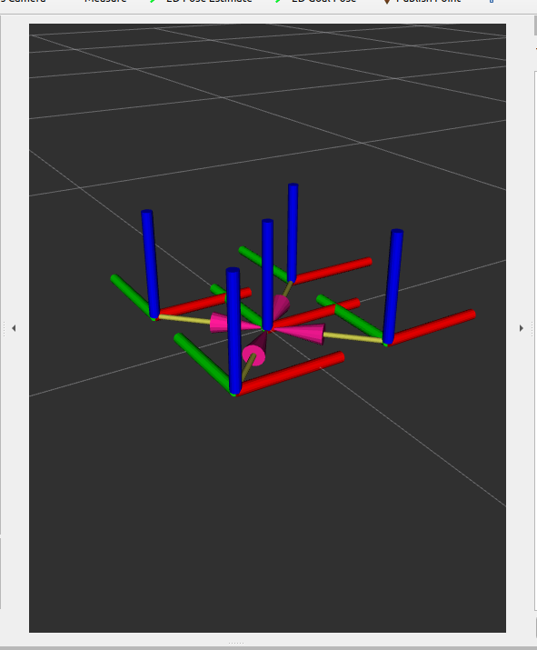

## mini_drone_sim

A humble ROS 2 simulation of a quadrotor drone with basic controller and IMU simulation — designed for use with RViz and future expansion into multi-agent systems or Isaac Sim.



---

## What it does

-  Custom URDF quadrotor model
-  Publishes TF and robot state
-  Fake IMU and basic controller nodes
-  Launch file with RViz visualization
-  ROS 2 (Humble) compatible 

---

##  Dependencies

- ROS 2 Humble
- `colcon` build system
- Python 3.10+
- RViz2

---

## Building the package

##  Quick Start on New Machine

```bash
mkdir -p ~/mini_drone_ws/src
cd ~/mini_drone_ws/src
git clone https://github.com/elsensoy/mini_drone_sim.git
cd ~/mini_drone_ws
colcon build
source install/setup.bash
ros2 launch mini_drone_sim view_drone.launch.py

---
 